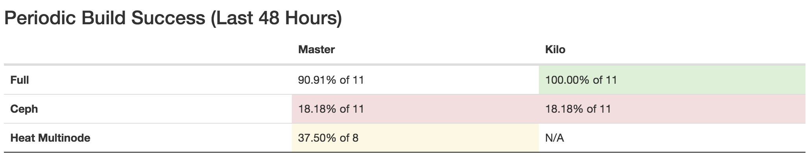
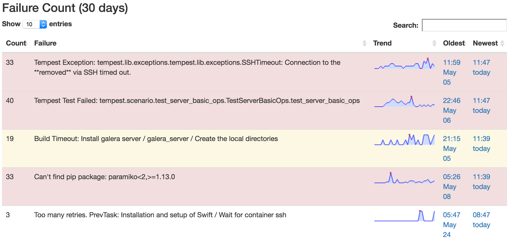
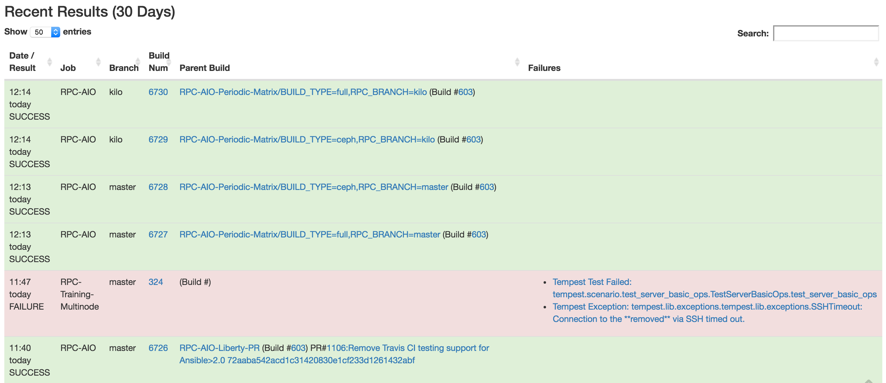

# RPC-Openstack Gating

## Linting
Linting is checking the syntax and style of the code without executing it. RPC Lint jobs are run by [Travis CI](https://travis-ci.org/).

### Linting Job Mechanics
  1. [rcbops/rpc-openstack](https://github.com/rcbops/rpc-openstack) has the travis integration enabled. This creates a webhook that posts [PR](https://github.com/rcbops/rpc-openstack/pulls) notifications to Travis. Note that the webhook isn't visible in the [github ui](https://github.com/rcbops/rpc-openstack/settings/hooks), as there is an official integration.
  1. Travis reads [.travis.yml](https://github.com/rcbops/rpc-openstack/blob/master/.travis.yml) which defines setup steps, the python versions to use and tox as the test runner.
  1. Tox reads [tox.ini](https://github.com/rcbops/rpc-openstack/blob/master/tox.ini) which defines two environments:
      1. [flake8](https://gitlab.com/pycqa/flake8) which runs      [scripts/linting-pep8.sh](https://github.com/rcbops/rpc-openstack/blob/master/scripts/linting-pep8.sh) to check for ansible style violations.
      1. [ansible-lint](https://github.com/willthames/ansible-lint)
     which runs [scripts/linting-ansible.sh](https://github.com/rcbops/rpc-openstack/blob/master/scripts/linting-pep8.sh). This script runs flake8 over all files with a python [shebang](https://en.wikipedia.org/wiki/Shebang_(Unix)) to check for python style violations.
  1. Once travis has completed it posts results back to github via the API, and github displays them in the PR.

## Functional Tests
Functional tests are defined as jobs within [Jenkins](http://jenkins.propter.net/).
### Jenkins Job Mechanics
  1. [rcbops/rpc-openstack](https://github.com/rcbops/rpc-openstack) has a webhook configured to notify Jenkins of new/updated PRs.
  1. Jenkins has the [github pull request builder (ghprb)](https://wiki.jenkins-ci.org/display/JENKINS/GitHub+pull+request+builder+plugin) plugin enabled. This interprets the received webhook and kicks off the necessary job.
  1. Once the job has completed, jenkins posts the results back to github via the API, and github displays them in the PR.

### Jenkins Jobs
There are two main Jobs:

  1. [RPC-AIO](http://jenkins.propter.net/job/RPC-AIO/). This job builds and tests all in one deployments on Rackspace cloud instances. Its phases are deploy-test-upgrade-test. Though this can be reduced to deploy-test for a shorter job.
      1. Instance Build: The RPC-AIO job is configured to only run on jenkins slaves with the label "rpcaio". There are no long running slaves with that label, however the [jenkins-jclouds](https://wiki.jenkins-ci.org/display/JENKINS/JClouds+Plugin) plugin is configured to create instances with that label, which it does on demand.
      1. Slave Registration: Jenkins connects to the instance via ssh, does some minimal configuration, registers the instance as a jenkins slave and runs the build steps as defined in the job. Currently this is clone [jenkins-rpc](https://github.com/rcbops/jenkins-rpc) and run [aio_build_script.sh](https://github.com/rcbops/jenkins-rpc/blob/master/scripts/aio_build_script.sh). aio_build_script does the following:
          1. Clone rpc-openstack, checkout the older version required by the job parameters
          1. Run the [RPC deploy script](https://github.com/rcbops/rpc-openstack/blob/master/scripts/deploy.sh).
          1. Run tempest by attaching to the local utility container and running /opt/[openstack_tempest_gate.sh](https://github.com/openstack/openstack-ansible-os_tempest/blob/master/templates/openstack_tempest_gate.sh.j2). The test set is specified as a job parameter, and may vary from job to job. Results are copied to the tempest log directory which is bind mounted into the utility container from the host.
          1. Checkout the newer version of RPC.
          1. Run the deploy script or upgrade script depending on the type of upgrade (the upgrade script is only used for major upgrades).
          1. Run tempest
      1. Log collection: This is a separate script block in the jenkins job configuration that doesn't affect job outcome. The logs are copied to the jenkins workspace on the slave. Jenkins then handles copying the logs from the slave workspace to the master before the slave is destroyed. The [jenkins junit](https://wiki.jenkins-ci.org/display/JENKINS/JUnit+Plugin) interprets the tempest results and displays graphs and [test information](http://jenkins.propter.net/job/RPC-AIO/lastCompletedBuild/testReport/).
      1. The slave is de-registered and the instance deleted.

  1. [RPC-Training-Multinode](http://jenkins.propter.net/job/RPC-Training-Multinode/). This job builds multi node deployments using heat templates and cloud instances. The [heat templates](https://github.com/hughsaunders/rpc-heat-ansible/tree/rpc_gating) are a modified version of the [cloud training templates developed by Byron Mccollum](https://github.com/cloud-training/rpc-heat-ansible). This job runs directly on the jenkins master as the majority of the work happens in instances created by heat. The build is started by running the [build script](https://github.com/hughsaunders/rpc-heat-ansible/blob/rpc_gating/jenkins/build.sh). Which does the following:
      1. Install python-heatclient
      1. Source pub cloud creds from the jenkins master
      1. Create a stack on public cloud passing from the [template](https://github.com/hughsaunders/rpc-heat-ansible/blob/rpc_gating/templates/rpc-ha-full-ceph.yml), a list of tags, maas-credentials and some variables defined in the jenkins job are passed in. The tags specify which tasks are run from the [playbooks](https://github.com/hughsaunders/rpc-heat-ansible/blob/rpc_gating/playbooks/rpc-12.0-playbook.yml) within rpc-heat-ansible. Heat creates the resources as specified in the template. This includes dropping a script on infra1 called [runcmd-bash](https://github.com/hughsaunders/rpc-heat-ansible/blob/rpc_gating/templates/rpc-ha-full-ceph.yml#L350-L422). A tmux session is started which runs runcmd-bash, which does the following:
          1. Install ansible
          1. Clone rpc-heat-ansible (to get the playbooks)
          1. Run the [playbook](https://github.com/hughsaunders/rpc-heat-ansible/blob/rpc_gating/playbooks/rpc-12.0-playbook.yml) This playbook does all the host setup pre-OSA including:
              1. Configure swap
              1. Prepare partition for storage
              1. Install packages
              1. Check connectivity between Nodes
              1. Clone RPC
              1. Template RPC Configuration files
              1. Install RPC (by running the [RPC deploy script](https://github.com/rcbops/rpc-openstack/blob/master/scripts/deploy.sh)
      1. Run tempest (SSH to infra1, lxc-attach to the utility container, run openstack_tempest_gate)
      1. SCP logs & test results from the infra1 instance back to the jenkins workspace. Jenkins then handles archiving logs from the workspace.
      1. Delete the stack to free resources.

#### Other Jobs:
  1. [RPC-AIO Build Summary](http://jenkins.propter.net/job/RPC-AIO%20Build%20Summary/): Generates a [dashboard](http://jenkins.propter.net:443/#) for results. This dashboard has three sections:
      1. Periodic Success: Shows how successfull periodic jobs have been over the last 48 hours. This is a good indication of current gate stability as periodic job stats are not pulled down by PR errors. 
      1. Recent Failures: This shows the most recent failures and their trend. This table is sorted by newest by default and can be filtered on any field. 
      1. Recent Results: This shows the last 30 days of results. This table is sorted by most recent can can be filtered on any field. 
  1. \*-PR: These jobs are the jobs that are triggered by github webhooks and the jenkins ghbrp plugin. They in turn initiate RPC-AIO jobs to do the actual build.
  1. [RPC-AIO-Periodic-Matrix](http://jenkins.propter.net/job/RPC-AIO-Periodic-Matrix/): This is a periodic job (runs on a schedule) which builds the a matrix of configurations. Currently (master,kilo)\*(full, ceph). Each configuration initiates an RPC-AIO build.
  1. [RPC-Upgrade-Matrix](http://jenkins.propter.net/job/RPC-Upgrade-Matrix/): Job which works out valid upgrade paths for master, active branches and previous major release. Each upgrade path is tested via an RPC-AIO job, which deploys the older version, runs tempest, then upgrades to the newer version and re-runs tempest.

### Jenkins Infrastructure
#### Authentication
Jenkins [authenticates against github](https://wiki.jenkins-ci.org/display/JENKINS/Github+OAuth+Plugin), any member of the [rcbops org](https://github.com/rcbops) is allowed to view jobs. The admins are a static list configured within the jenkins UI. Admins can CRUD jobs and generally administer jenkins.

#### Deployment
The jenkins master runs within Docker on a pub cloud instance. The instance has a cloud block storage device attached, which is passed through to the docker instance so that job storage is persistent.

The [dockerfile is kept in jenkins-rpc](https://github.com/rcbops/jenkins-rpc/blob/master/dockerfiles/jenkins/Dockerfile).

The instance has regular backups, but too much information is still stored within jenkins jobs. A TODO is to move as much as possible into git, either using [JJB](http://docs.openstack.org/infra/jenkins-job-builder/) or [Jenkinsfile](https://jenkins.io/blog/2015/12/03/pipeline-as-code-with-multibranch-workflows-in-jenkins/).
